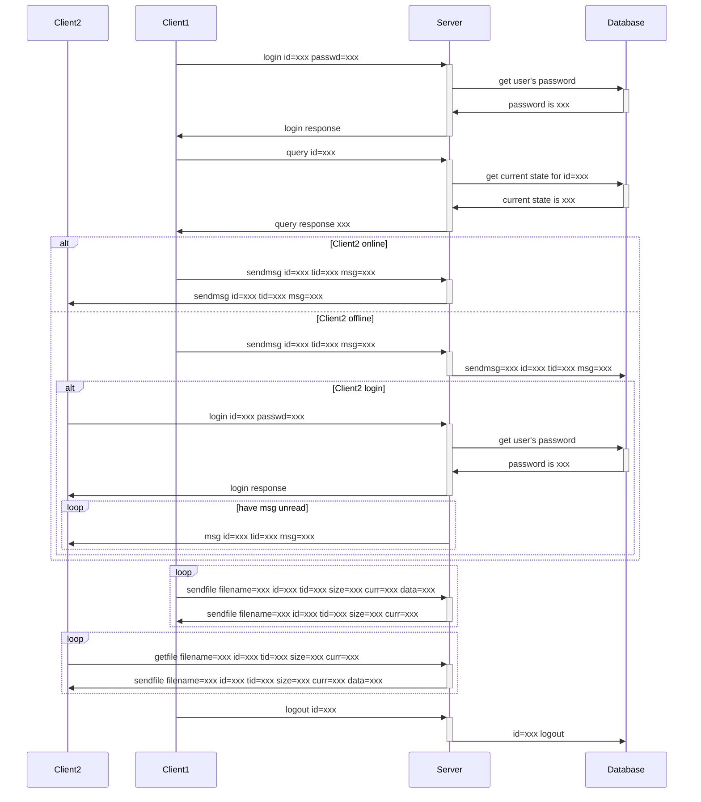
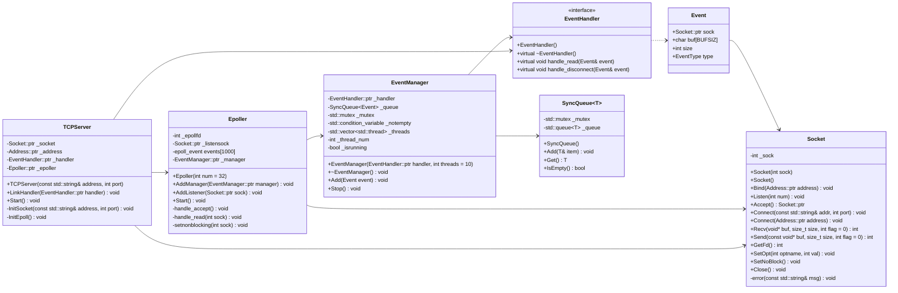
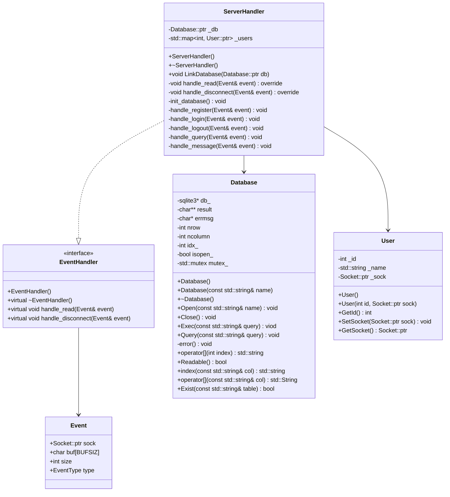

# Chatroom

C++ 控制台聊天室

## 实现功能

- 私聊
- 广播
- 发送文件

## 协议设计

需要处理的事件有：

1. 登陆
2. 注册
3. 注销
4. 请求信息
5. 发送消息
6. 发送文件
7. 接收文件

## 结构设计

### TCPServer 设计

`TCPServer` 使用 `epoll` 监听客户端请求，收到请求后将报文存储到 `SyncQueue` 并等待线程池处理请求

下面是类图：

结合类图可以看出 `TCPServer` 的运作分如下几个部分：

1. `Epoller` 负责监听 `epoll` 描述符监听客户端的连接和请求操作。当 `Epoller` 接收到连接请求时，创建 `Event` 结构体并将其送至 `EventManager` 中
2. `EventManager` 一旦接收到来自 `Epoller` 的数据，便将其添加到 `SyncQueue` 这个同步队列中
3. `EventManager` 在初始化时创建了一个线程池，只要 `SyncQueue` 中有数据，就会唤醒一个线程处理从 `Epoller` 传来的数据

经过上面几个类的处理，我们将客户端请求的处理函数分离了出来，在完成我们的聊天室时只需实现 `EventHandler` 这个接口即可

### 聊天室服务端设计

### 聊天室客户端设计

## 数据库设计

### user

| uid | passwd      | uname       | status | time      |
| --- | ----------- | ----------- | ------ | --------- |
| int | varchar(32) | varchar(32) | int    | timestamp |

- 这里的 `status` 保存用户登陆状态，取值为在线（1）和下线（0）
- `time` 保存用户上次登陆时间或下线时间

### message

| uid | type | tid | msg  | time      |
| --- | ---- | --- | ---- | --------- |
| int | int  | int | text | timestamp |

该表同时保存群聊信息和私聊信息，通过 `type` 字段区分群聊和私聊：

- `type` 为 0 代表私聊
- `type` 为 1 代表群聊

### file

| uid | tid | filename | size | time      | status | curr |
| --- | --- | -------- | ---- | --------- | ------ | ---- |
| int | int | text     | int  | timestamp | int    | int  |

这里 `status` 有三种状态

- 0，客户端发送中
- 1，已发送
- 2，客户端接受中

## TODO

- 好友功能（好友添加请求 balabala）
- 创建群聊（）
