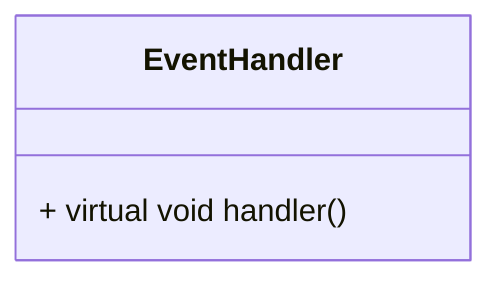

# Chatroom

C++ 聊天室

## 结构设计

`epoll` + 工作队列 + 线程池实现高并发。`server` 端提供 `EventHandler` 接口

## 数据库设计

### user

| uid | passwd      | uname       | status | time      |
| --- | ----------- | ----------- | ------ | --------- |
| int | varchar(32) | varchar(32) | int    | timestamp |

- 这里的 `status` 保存用户登陆状态，取值为在线（1）和下线（0）
- `time` 保存用户上次登陆时间或下线时间

### friend

| uid1 | uid2 |
| ---- | ---- |
| int  | int  |

为加快数据库查询时间，我们默认 id1 < id2

### group

| gid | uid | gname       |
| --- | --- | ----------- |
| int | int | varchar(32) |

该表保存每个群聊的 `gid` 和其创建用户的 `uid` 还有群名称

### groupuser

| gid | uid |
| --- | --- |
| int | int |

### message

| uid | type | tid | msg  | time      |
| --- | ---- | --- | ---- | --------- |
| int | int  | int | text | timestamp |

该表同时保存群聊信息和私聊信息，通过 `type` 字段区分群聊和私聊：

- `type` 为 0 代表私聊
- `type` 为 1 代表群聊

### file

| uid | tid | filename | size | time      | status | curr |
| --- | --- | -------- | ---- | --------- | ------ | ---- |
| int | int | text     | int  | timestamp | int    | int  |

这里 `status` 有三种状态

- 0，客户端发送中
- 1，已发送
- 2，客户端接受中
